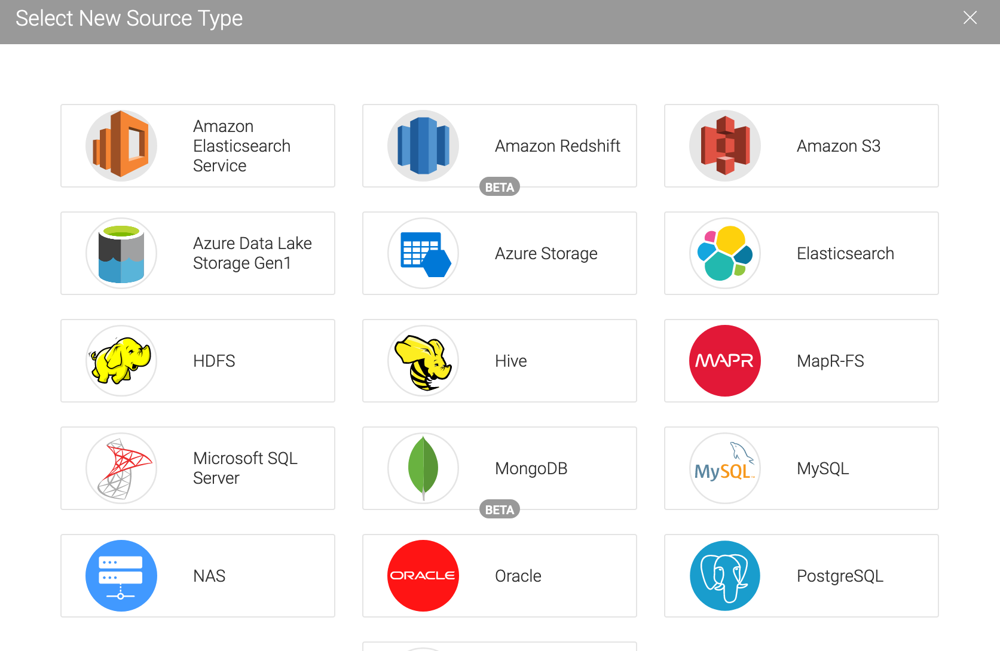

Tutorial "How to connect Dremio to Ontop"
=====================================================================================================

Inthis tutorial we present step-by-step the way of connecting Dremio to Ontop. We show how to integrate **uni1** data saved in the PostgreSQL database and *uni2* data saved in plain JSON files into one Dremio data space. 

Before you proceed, we recommend you to see the following tutorials provided by Dremio:

  1. [Getting oriented with Dremio](https://www.dremio.com/tutorials/getting-oriented-to-dremio/)
  2. [Working with your first dataset](https://www.dremio.com/tutorials/working-with-your-first-dataset/)


As a first step, by following the instructions in [Working with your first dataset](https://www.dremio.com/tutorials/working-with-your-first-dataset/), we create a *space* named **integrated_university_data** as shown below.

Add new data space:
 

Save the new data space:


It will be our data space in which we integrate data from various sources.

The *uni1* data is contained in a PostgreSQL database named *university-session1*. Either you can download the SQL script that generates the database from [here](postgres-docker/db/university-session1.sql) and load it to your local PostgreSQL server, or you can run the docker container that we provide by executing the following script:

```bash
IMAGENAME="university-db"
docker ps -q --filter ancestor=$IMAGENAME | xargs docker stop
docker build -t $IMAGENAME .
docker run -p 5435:5432 $IMAGENAME
``` 
 
The database *university-session1* becomes accesable with the following JDBC URL:

```sql
jdbc:postgresql://localhost:5435/university-session1?user=postgres&password=postgres
``` 

Now we are ready to add our database as a new datasource into Dremio:


Select PostgreSQL:



Enter the required JDBC information:


Now we see the tables in *university-session1*:


Now we add the *uni2* data as a JSON data source:

![Add ]